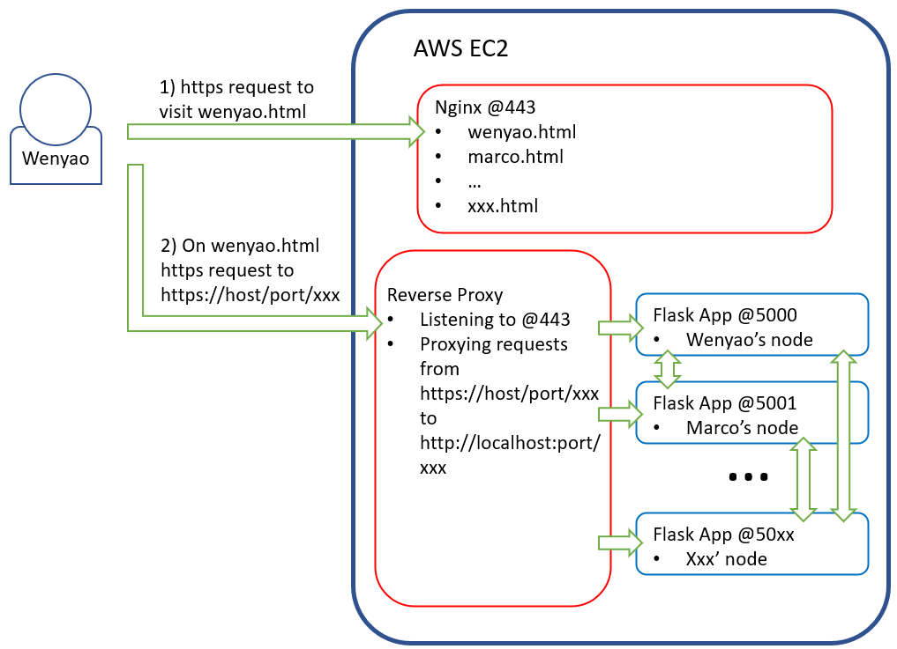

# Demo of Proof-of-Work Blockchain

## Overview
* `bash/deploy` bash script to deploy the demo
* `python/blockchain.py` the blockchain class and functions
* `python/server.py` the flask server
* `input/node_ids.csv` the input file of port number and node id

## Instructions to Deploy on an AWS EC2 Instance
1. `cd ~`
2. `git clone https://github.com/shawenyao/blockchain.git`
3. `curl https://freedns.afraid.org/dynamic/update.php?xxxxxxxxxx`
4. Follow the guide (https://docs.aws.amazon.com/AWSEC2/latest/UserGuide/SSL-on-amazon-linux-2.html#letsencrypt or https://certbot.eff.org/, depending on system) to request https certificate of `hbschain.us.to` 
5. `sudo ~/blockchain/bash/deploy`
6. Add the following two lines to `/etc/httpd/conf/httpd-le-ssl.conf` or `/etc/apache2/sites-enabled/000-default-le-ssl.conf`, depending on system:
```
RewriteEngine on
RewriteRule "^/?(5\d{3})/(.*)" "http://localhost:$1/$2" [P,L,NE]
```
6. `~/blockchain/bash/bcstartn %number_of_nodes%`, where `%number_of_nodes%` should be replaced by a number no bigger than the number of rows in `input/node_ids.csv`

## Architecture


## References
Learn Blockchains by Building One

https://hackernoon.com/learn-blockchains-by-building-one-117428612f46

Learn Blockchains using Spreadsheets

https://medium.com/@vanflymen/learn-blockchains-using-spreadsheets-b97ad92b9b4d

How do peer-to-peer programs discover each other?

https://jameshfisher.com/2017/08/11/peer-to-peer-discovery/

Nested tables from json

http://bl.ocks.org/nautat/4085017

Read lines from a file into a Bash array

https://stackoverflow.com/questions/11393817/read-lines-from-a-file-into-a-bash-array

How to split a string into an array in Bash?

https://stackoverflow.com/questions/10586153/how-to-split-a-string-into-an-array-in-bash
